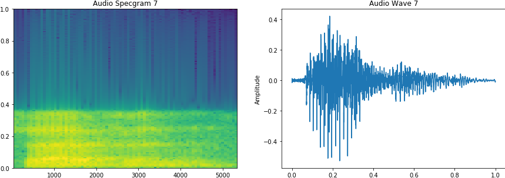

<!-- PROJECT SHIELDS -->
<!--
*** I'm using markdown "reference style" links for readability.
*** Reference links are enclosed in brackets [ ] instead of parentheses ( ).
*** See the bottom of this document for the declaration of the reference variables
*** for contributors-url, forks-url, etc. This is an optional, concise syntax you may use.
*** https://www.markdownguide.org/basic-syntax/#reference-style-links
*** To avoid retyping too much info. Do a search and replace for the following:
*** github_username, repo_name, twitter_handle, email.
*** ref: https://github.com/othneildrew/Best-README-Template/blob/master/BLANK_README.md
-->
[![Contributors][contributors-shield]][contributors-url]
[![Forks][forks-shield]][forks-url]
[![Stargazers][stars-shield]][stars-url]
[![Issues][issues-shield]][issues-url]
[![MIT License][license-shield]][license-url]
[![LinkedIn][linkedin-shield]][linkedin-url]

<!-- PROJECT LOGO -->
<br />
<p align="center">
  <a href="https://github.com/junzhuang-code/audio_classification">
    
  </a>
  <h3 align="center">Audio Classification</h3>
  <p align="center">
    Author: **Jun Zhuang**
    <br />
    <a href="https://github.com/junzhuang-code/audio_classification"><strong>Explore the project »</strong></a>
    <br />
    <br />
    <a href="https://github.com/junzhuang-code/audio_classification/issues">Report Bug</a>
    ·
    <a href="https://github.com/junzhuang-code/audio_classification/issues">Request Feature</a>
  </p>
</p>

<!-- TABLE OF CONTENTS -->
## Table of Contents

* [About The Project](#about-the-project)
  * [Dataset](#dataset)
  * [Preprocessing](#preprocessing)
  * [Methods](#methods)
* [Getting Started](#getting-started)
  * [Prerequisites](#prerequisites)
  * [Clone this repo](#clone-this-repo)
  * [Install dependencies](#install-dependencies)
  * [Download audio dataset](#download-audio-dataset)
  * [Files](#files)
  * [Runs](#runs)
* [LICENSE](#license)
* [Acknowledgments](#acknowledgments)


<!-- ABOUT THE PROJECT -->
## About The Project

This project is a in-class competition held on Kaggle.com. The major task is to classify short audio clips of spoke digits 0 to 9. The training set contains digits from 0 to 9 except 2. The testing set contains all digits. Thus, besides classification, this project will also employ anomaly detection method to improve the final prediction. The project eventually got No.3 on private leader-board.
[![Leaderboard Screenshot][leaderboard-screenshot]](https://example.com)

### Dataset

Each row in the audio dataset corresponds to a spoken digit (0 to 9) sampled at 22050 hz. The competition only provides train labels. Note that there are no digit 2 in the training data. The sample audio wave is visualized as below:

### Preprocessing

1. **Audio Data Augmentation**
The project includes four different types of data augmentation methods: add white noise, shift the wave, change the speed of audio and then padding to original length, shift the pitch. Each method is executed twice for each one audio wave.

2. **Convert The Wave to 2-D Spectrogram**
After data augmentation, the dataset is converted to 2-D spectrogram and then change the dimension accordingly. The dimension should be 4 if CNN/GAN model is employed; the dimension should be 3 if LSTM model is employed; the dimension should be 2 if GMM model is employed.

3. **Split The Dataset**
By the end, the dataset is split to training/testing with the split ratio=0.1.

### Methods

In this project, **NINE** models are attempted as following: 1D-CNN, 2D-CNN, LSTM, BiLSTM, RFC, VAE, GAN, BiGAN, GMM. The first five models are used for classification. Rest four models are used for anomaly detection. The experimental result indicates that 1D-CNN, RFC, VAE are failed for its purpose. 2D-CNN and BiLSTM achieve high testing accuracy on local testing set. BiGAN is developed from GAN and used for anomaly detection. GMM performs similar purpose with different approach.

The total process is summarized as following: At first, 2D-CNN or BiLSTM is employed to generated predicted label. However, this label cannot tell which digit is 2. To address this issue, BiGAN and GMM are utilized for anomaly detection to find out possible outliers. The experiment repeats several times and carefully selects the intersection. Note that the whole process is not end-to-end.


<!-- GETTING STARTED -->
## Getting Started

### Prerequisites

* Linux or macOS
* CPU or NVIDIA GPU + CUDA CuDNN
* Python 3
* numpy, pandas, librosa, sklearn, tensorflow 2.x

### Clone this repo

```sh
git clone https://github.com/junzhuang-code/audio_classification.git
```
```sh
cd audio_classification
```

### Install dependencies

* For pip users, please type the command ```pip install -r requirements.txt```
* For Conda users, you may create a new Conda environment using ```conda env create -f environment.yml```

### Download audio dataset

The dataset comes from Kaggle competition:
```
https://www.kaggle.com/c/audio-classification/overview
```

### Files

Under dir **audio_data**:
* **audio_train.npy**, **audio_test.npy**, **labels_train.csv**.

Under dir **audio_classification**:
* **preproc.py**: preprocessing
* **classification.py**: classification
* **anomaly_detection.py**: anomaly detection
* **utils.py**: other utils modules
* **model_{CNN, LSTM, BiGAN}.py**: models of {CNN, BiLSTM(LSTM), BiGAN(GAN)}
* **gmm_ad.py**: employ GMM for anomaly detection
* **cnn1d.py**: test 1D-CNN model
* **vae_rfc.py**: test VAE and random forest classifier (RFC) model

### Runs

* Preprocessing: ```python preproc.py -data_type```
* Classification: ```python classification.py -data_type -NUM_EPOCHS```
* Anomaly detection: ```anomaly_detection.py -NUM_EPOCHS -NUM_OUTLIERS -is_trainable```


<!-- LICENSE -->
## LICENSE

Distributed under the MIT License. See `LICENSE` for more information.


<!-- ACKNOWLEDGEMENTS -->
## Acknowledgments

Thanks professor Mohler for instruction.


<!-- MARKDOWN LINKS & IMAGES -->
<!-- https://www.markdownguide.org/basic-syntax/#reference-style-links -->
[contributors-shield]: https://img.shields.io/github/contributors/junzhuang-code/repo.svg?style=flat-square
[contributors-url]: https://github.com/junzhuang-code/repo/graphs/contributors
[forks-shield]: https://img.shields.io/github/forks/junzhuang-code/repo.svg?style=flat-square
[forks-url]: https://github.com/junzhuang-code/repo/network/members
[stars-shield]: https://img.shields.io/github/stars/junzhuang-code/repo.svg?style=flat-square
[stars-url]: https://github.com/junzhuang-code/repo/stargazers
[issues-shield]: https://img.shields.io/github/issues/junzhuang-code/repo.svg?style=flat-square
[issues-url]: https://github.com/junzhuang-code/repo/issues
[license-shield]: https://img.shields.io/github/license/junzhuang-code/repo.svg?style=flat-square
[license-url]: https://github.com/junzhuang-code/repo/blob/master/LICENSE.txt
[linkedin-shield]: https://img.shields.io/badge/-LinkedIn-black.svg?style=flat-square&logo=linkedin&colorB=555
[linkedin-url]: https://www.linkedin.com/in/jun-zhuang-74800957/
[leaderboard-screenshot]: images/leaderboard_screenshot.png
